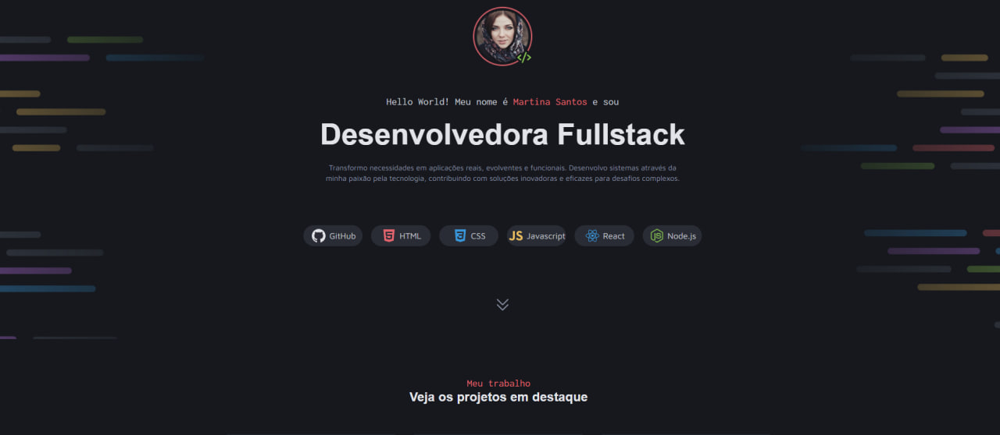

# 💼 Portfolio Dev

Esse é o meu portfólio pessoal desenvolvido com **HTML** e **CSS puro**, onde coloquei em prática os conhecimentos adquiridos durante meus estudos. O projeto é simples, direto ao ponto e focado na apresentação profissional — com um toque da minha personalidade!

---

## 🚀 Sobre o projeto

Este portfólio foi criado como parte da minha jornada de transição de carreira para a área de **Desenvolvimento Web**. Busquei construir uma estrutura limpa, responsiva e fácil de navegar, destacando meus projetos, habilidades e formas de contato.

---

## 🛠️ Tecnologias utilizadas

- HTML5  
- CSS3  
- Layout responsivo com Flexbox e Media Queries

---

## 📱 Responsividade

O site foi pensado para se adaptar a diferentes tamanhos de tela, desde dispositivos móveis até monitores maiores, garantindo uma boa experiência para quem acessa de qualquer lugar.

---

## 📌 Funcionalidades

- Página inicial com apresentação  
- Sessão de projetos em destaque  
- Habilidades técnicas  
- Contato com links para redes sociais  

---

## 📷 Preview

> Você pode adicionar essa imagem manualmente ao repositório com o nome `preview.png` para que o GitHub exiba corretamente o preview acima.

---

## 👨‍💻 Sobre mim

Me chamo **Jeferson Gutierrez**, sou estudante de Análise e Desenvolvimento de Sistemas e apaixonado por tecnologia. Estou focado em conquistar minha primeira oportunidade como desenvolvedor web.

---

## 📬 Contato

- GitHub: [@ghutttyerrez](https://github.com/ghutttyerrez)  
- LinkedIn: *adicione seu link aqui se desejar*  
- E-mail: *adicione seu e-mail se desejar*

---

## 📄 Licença

Este projeto está sob a licença MIT.  
Sinta-se à vontade para usar como referência no seu próprio portfólio!

---

✨ Feito com dedicação por [Jeferson Gutierrez](https://github.com/ghutttyerrez)
